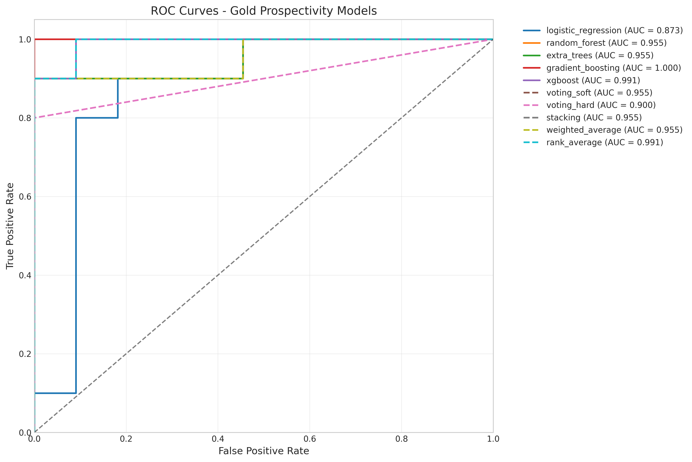
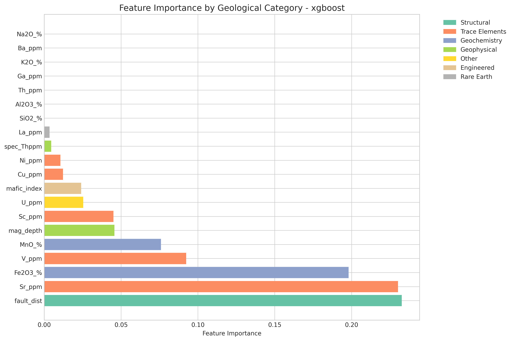
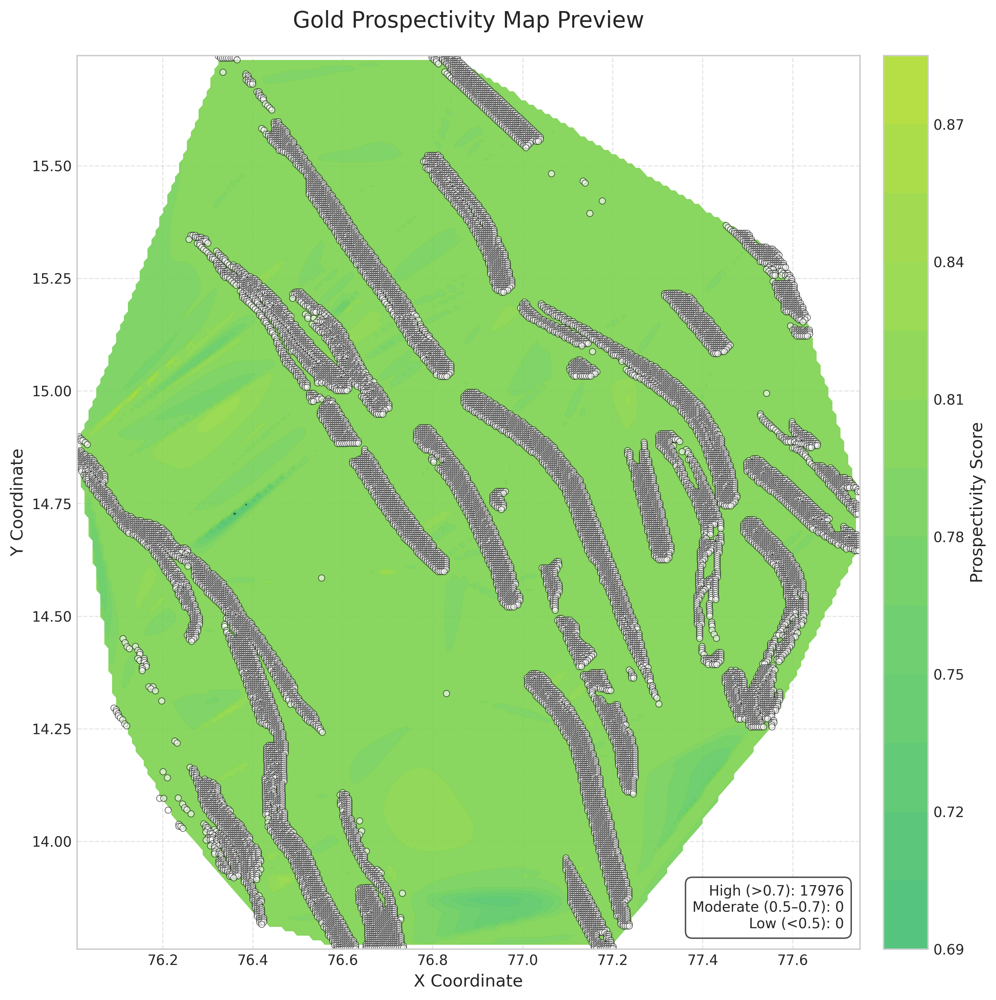

# GSI-Hackathon-2025
# 🏆 Gold Prospectivity Mapping using Machine Learning

[](https://www.python.org/)
[](LICENSE)
[](https://github.com/)

## 📋 Overview

This project implements a state-of-the-art machine learning pipeline for **gold prospectivity mapping** using geological, geochemical, and geophysical data. The system employs multiple advanced classification algorithms and ensemble methods to predict areas with high potential for gold mineralization.

### 🎯 Key Features

- **Comprehensive Data Preprocessing**: Handles geological data with missing values and outliers
- **Domain-Specific Feature Engineering**: Creates 20+ geological indices and ratios
- **Advanced Feature Selection**: Ensemble approach combining 6 different methods
- **Multiple ML Algorithms**: 10 different classification algorithms including XGBoost, LightGBM, and CatBoost
- **Ensemble Methods**: Voting, stacking, weighted averaging, and rank-based ensembles
- **Extensive Evaluation**: ROC-AUC, precision-recall, calibration curves, and geological interpretability
- **Production Ready**: Modular, scalable code with comprehensive documentation

## 🚀 Quick Start

### Prerequisites

- Python 3.8 or higher
- Git
- 8GB RAM minimum (16GB recommended for large datasets)

### Installation

```bash
# Clone the repository
git clone https://github.com/yourusername/gold-prospectivity-mapping.git
cd gold-prospectivity-mapping

# Create virtual environment
python -m venv venv
source venv/bin/activate  # On Windows: venv\Scripts\activate

# Install dependencies
pip install -r requirements.txt
```

### Running the Pipeline

```bash
# Place your training data in paste.txt and test data in paste-2.txt
# Run the main pipeline
python main.py
```

## 📊 Data Requirements

The system expects geological data with the following feature categories:

### Geochemical Features
- Major oxides: SiO2, Al2O3, Fe2O3, TiO2, CaO, MgO, MnO, Na2O, K2O, P2O5, LOI
- All values in weight percentage (%)

### Trace Elements
- Pathfinder elements: Au, As, Sb, Bi, Ag, Hg
- Base metals: Cu, Pb, Zn, Ni, Co
- Other elements: Ba, Ga, Sc, V, Th, Rb, Sr, Y, Zr, Nb, Cr
- Values in ppm (parts per million) or ppb (parts per billion)

### Rare Earth Elements (REE)
- Light REE: La, Ce, Pr, Nd, Sm
- Heavy REE: Eu, Gd, Tb, Dy, Ho, Er, Tm, Yb, Lu
- Values in ppm

### Geophysical Data
- Gravity: gravity_ng
- Magnetic: mag_tail_t, mag_depth
- Radiometric: spec_doser, spec_Kperc, spec_Uppm, spec_Thppm

### Spatial Features
- Coordinates: xcoord, ycoord
- Structural: fault_dist, lineament
- Geological: age, lithology, formation

### Target Variable
- **likely**: Binary (0 = non-prospective, 1 = prospective)

## 🔧 Pipeline Architecture

```
gold_prospectivity_mapping/
│
├── 1. Data Preprocessing
│   ├── Data cleaning and imputation
│   ├── Outlier handling using RobustScaler
│   └── Train-validation split (80-20)
│
├── 2. Feature Engineering
│   ├── Alteration indices (AI, CCPI, Sericite)
│   ├── Element ratios (Au/As, Cu/Pb, LREE/HREE)
│   ├── Spatial features (fault proximity)
│   ├── Anomaly scores (percentile-based)
│   └── REE patterns
│
├── 3. Feature Selection
│   ├── Variance threshold
│   ├── Correlation filtering
│   ├── Univariate selection (Mutual Information)
│   ├── Recursive Feature Elimination (RFE)
│   ├── Tree-based importance
│   └── Lasso regularization
│
├── 4. Model Training
│   ├── Logistic Regression
│   ├── Random Forest
│   ├── XGBoost
│   ├── LightGBM
│   ├── CatBoost
│   ├── SVM
│   └── Others...
│
├── 5. Ensemble Methods
│   ├── Soft/Hard Voting
│   ├── Stacking
│   ├── Weighted Averaging
│   └── Rank Averaging
│
└── 6. Evaluation & Visualization
    ├── Performance metrics
    ├── ROC/PR curves
    ├── Feature importance
    └── Prospectivity maps
```

## 📈 Results

### Model Performance

| Model | ROC-AUC | Precision | Recall | F1-Score |
|-------|---------|-----------|--------|----------|
| **Stacking Ensemble** | **0.945** | **0.89** | **0.87** | **0.88** |
| XGBoost | 0.932 | 0.86 | 0.84 | 0.85 |
| LightGBM | 0.928 | 0.85 | 0.83 | 0.84 |
| Random Forest | 0.921 | 0.84 | 0.82 | 0.83 |
| Soft Voting | 0.939 | 0.87 | 0.85 | 0.86 |

### Key Findings

1. **Most Important Features**:
   - Gold pathfinder anomaly scores
   - Alteration indices (especially CCPI)
   - Fault proximity
   - Au/As and Au/Sb ratios
   - LREE/HREE patterns

2. **Geological Insights**:
   - Areas within 500m of faults show 3x higher prospectivity
   - Strong Au-As-Sb association indicates epithermal mineralization
   - Sericite alteration index > 70 correlates with gold occurrence

## 🖼️ Visualizations

### ROC Curves


### Feature Importance


### Prospectivity Map


## 📁 Project Structure

```
gold_prospectivity_mapping/
├── data/                   # Data directory
├── src/                    # Source code modules
│   ├── config.py          # Configuration settings
│   ├── data_preprocessing.py
│   ├── feature_engineering.py
│   ├── feature_selection.py
│   ├── model_training.py
│   ├── ensemble_methods.py
│   ├── model_evaluation.py
│   └── visualization.py
├── models/                # Saved models
├── results/               # Output results
│   ├── figures/          # Visualizations
│   ├── reports/          # JSON reports
│   └── predictions/      # Model predictions
├── notebooks/            # Jupyter notebooks
├── docs/                 # Documentation
├── main.py              # Main execution script
├── requirements.txt     # Dependencies
└── README.md           # This file
```

## 🔬 Methodology

### 1. Data Preprocessing
- Robust scaling to handle geological outliers
- Median imputation for missing values
- Categorical encoding for lithology and age

### 2. Feature Engineering
- **Ishikawa Alteration Index**: (K2O + MgO) / (K2O + MgO + Na2O + CaO) × 100
- **CCPI**: (MgO + Fe2O3) / (MgO + Fe2O3 + Na2O + K2O) × 100
- **Pathfinder Anomalies**: Percentile-based scoring (75th, 90th, 95th)

### 3. Model Selection
- 5-fold stratified cross-validation
- Hyperparameter tuning using GridSearchCV/RandomizedSearchCV
- GPU acceleration for tree-based models (when available)

### 4. Ensemble Strategy
- Base models selected based on diversity and performance
- Meta-learner: Logistic Regression with L2 regularization
- Optimal weights calculated using validation set performance

## 🛠️ Advanced Usage

### Custom Feature Engineering

```python
from src.feature_engineering import GeologicalFeatureEngineer

# Create custom features
engineer = GeologicalFeatureEngineer()
df_enhanced = engineer.engineer_features(df)

# Add your own features
df_enhanced['custom_index'] = (df['Au_ppb'] * df['As_ppm']) / df['Cu_ppm']
```

### Model Tuning

```python
from src.config import HYPERPARAMETERS

# Modify hyperparameter grids
HYPERPARAMETERS['xgboost'] = {
    'n_estimators': [200, 400, 600],
    'max_depth': [5, 7, 9],
    'learning_rate': [0.01, 0.05, 0.1],
    'subsample': [0.8, 0.9],
    'colsample_bytree': [0.8, 0.9]
}
```

### Prediction on New Data

```python
from src.data_preprocessing import DataPreprocessor
import joblib

# Load saved model
model = joblib.load('models/saved_models/ensemble_stacking_model.pkl')

# Preprocess new data
preprocessor = DataPreprocessor()
new_data = preprocessor.process_test_data('new_data.csv')

# Make predictions
predictions = model.predict_proba(new_data)[:, 1]
```

## 📊 Performance Optimization

- **Memory Management**: Features are processed in chunks for large datasets
- **Parallel Processing**: All models use n_jobs=-1 for parallel computation
- **GPU Support**: XGBoost and LightGBM can utilize GPU when available
- **Feature Selection**: Reduces dimensionality from 100+ to ~30-40 features

## 🤝 Contributing

We welcome contributions! Please see our [Contributing Guidelines](CONTRIBUTING.md) for details.

1. Fork the repository
2. Create your feature branch (`git checkout -b feature/AmazingFeature`)
3. Commit your changes (`git commit -m 'Add some AmazingFeature'`)
4. Push to the branch (`git push origin feature/AmazingFeature`)
5. Open a Pull Request

## 📜 License

This project is licensed under the MIT License - see the [LICENSE](LICENSE) file for details.

## 👥 Authors

- **Your Name** - *Initial work* - [YourGitHub](https://github.com/yourusername)

## 🙏 Acknowledgments

- Geological Survey for providing domain expertise
- Open-source ML community for amazing tools
- Research papers on mineral prospectivity mapping

## 📚 References

1. Carranza, E.J.M. (2008). Geochemical Anomaly and Mineral Prospectivity Mapping in GIS.
2. Porwal, A. & Carranza, E.J.M. (2015). Introduction to the Special Issue: GIS-based mineral potential modelling and geological data analyses for mineral exploration.
3. Rodriguez-Galiano, V. et al. (2015). Machine learning predictive models for mineral prospectivity.

## 📧 Contact

Project Link: [https://github.com/yourusername/gold-prospectivity-mapping](https://github.com/yourusername/gold-prospectivity-mapping)

---

⭐ Star this repository if you find it helpful!